# authz-plane — System Design Document

**Status:** Draft v1 · **Owner:** Raj Kolekar · **Audience:** you, plus any interviewer who opens this repo

---

## Table of contents

1. [Problem statement](#1-problem-statement)
2. [Goals and non-goals](#2-goals-and-non-goals)
3. [Key design decisions](#3-key-design-decisions)
4. [System context](#4-system-context)
5. [Container architecture](#5-container-architecture)
6. [Clean architecture layering](#6-clean-architecture-layering)
7. [The reconciliation model](#7-the-reconciliation-model)
8. [Data model](#8-data-model)
9. [API surface](#9-api-surface)
10. [UI: framework decision](#10-ui-framework-decision)
11. [Security design](#11-security-design)
12. [Observability and SLOs](#12-observability-and-slos)
13. [Testing strategy](#13-testing-strategy)
14. [CI/CD](#14-cicd)
15. [Deployment topology](#15-deployment-topology)
16. [Repository layout](#16-repository-layout)
17. [ADR index](#17-adr-index)
18. [10-day plan of action](#18-10-day-plan-of-action)
19. [Risk register](#19-risk-register)
20. [Definition of done](#20-definition-of-done)

---

## 1. Problem statement

Multi-tenant B2B platforms need per-tenant identity (SSO connections, users, orgs) and per-tenant authorization (roles, permissions, relationships). In practice this state lives in three disconnected places: an IdP console, an authorization service, and an application database. Nobody knows what the intended configuration is, changes are applied by hand, and drift between intended and actual state is discovered during incidents.

**authz-plane is a control plane that makes tenant identity and authorization configuration declarative.** You submit a desired-state spec; the system continuously reconciles the IdP and the authorization store toward it, detects drift, and records every decision and change.

This is the generalized, vendor-neutral form of work I do on Auth0 + Terraform in production. The project exists to prove the pattern transfers, and to prove I understand the Zanzibar authorization model rather than one vendor's API.

---

## 2. Goals and non-goals

### Goals

| # | Goal | Why it matters |
|---|---|---|
| G1 | Declarative tenant spec, versioned and immutable | Auditability, rollback, review-before-apply |
| G2 | Continuous reconciliation with convergence guarantees | The core control-plane property |
| G3 | Drift detection between desired and actual state | The thing that catches manual console edits |
| G4 | Relationship-based authorization (ReBAC) with an explain trace | Answers "why was this allowed" |
| G5 | Full audit trail of who changed what, when, and what the system did about it | Non-negotiable on an auth system |
| G6 | Tenant isolation enforced at every layer | The primary security property |
| G7 | Vendor-swappable IdP and authorization store behind ports | Proves the abstraction is real |

### Non-goals

- **Not building an IdP.** Zitadel does that. Writing your own token issuer for a portfolio project is a red flag, not a feature.
- **Not building a policy engine.** OpenFGA does that.
- **Not production-ready.** The README will say this explicitly. Claiming production-readiness for a 10-day single-author project destroys credibility faster than any missing feature.
- **Not multi-region, not HA.** Single-node k3s. Design for it, don't build it.
- **No billing, no marketplace, no tenant self-signup.** Scope discipline.

---

## 3. Key design decisions

### 3.1 Control plane with its own API, not a Kubernetes operator

The tempting design is CRDs (`Tenant`, `IdentityProvider`, `RelationTuple`) with a .NET controller. A C# operator is rare and memorable. I rejected it as the *primary* architecture for four reasons:

1. **The UI would have to talk to the Kubernetes API server.** Browser → kube-apiserver means either exposing the API server publicly (bad) or building a proxy — at which point you've built the API anyway, just worse.
2. **etcd is not a query store.** Drift history, audit search, reconcile-run timelines, and "show me every tenant whose IdP config changed last week" all want SQL. etcd gives you key-value with watches.
3. **Multi-tenant authorization over CRDs is awkward.** Kubernetes RBAC is namespace-scoped and verb-based. Modelling "tenant admin can edit their own tenant's relations but not another's" fights the grain.
4. **The reconciliation semantics are the valuable part, not the CRD packaging.** `generation` vs `observedGeneration`, plan/apply separation, finalizers, backoff, drift resync — all of it works identically over a Postgres-backed spec table.

**Decision:** control plane owns its API and Postgres. A `Kubernetes adapter` that maps CRs onto the control plane API is a Phase-2 stretch (ADR-009). If it ships, you get the operator story for free; if it doesn't, nothing is broken.

### 3.2 Plan / Apply separation

`Plan(desired, actual) -> Change[]` is a **pure function**. No I/O. `Apply(Change[])` is the only side-effecting path.

This is the single most important structural choice in the project:
- The planner is exhaustively unit-testable and property-testable without any container running.
- The plan is a first-class artifact you can render in the UI *before* applying (a `terraform plan` equivalent).
- Idempotency becomes a testable property: `Plan(desired, Apply(Plan(desired, actual))) == []`.

### 3.3 Outbox for reconcile triggers

Spec writes and reconcile-intent enqueue happen in one Postgres transaction via an outbox table. No dual-write between DB and queue, no lost reconciles, no need for a broker in the MVP. Workers poll with `FOR UPDATE SKIP LOCKED`.

### 3.4 Read-repair drift detection, not just event-driven

Event-driven reconcile catches your own writes. It cannot catch someone editing the Zitadel console directly. So there is a periodic full resync per tenant that reads actual state, hashes it, and records drift findings. This is what makes it a control plane and not a job queue.

---

## 4. System context

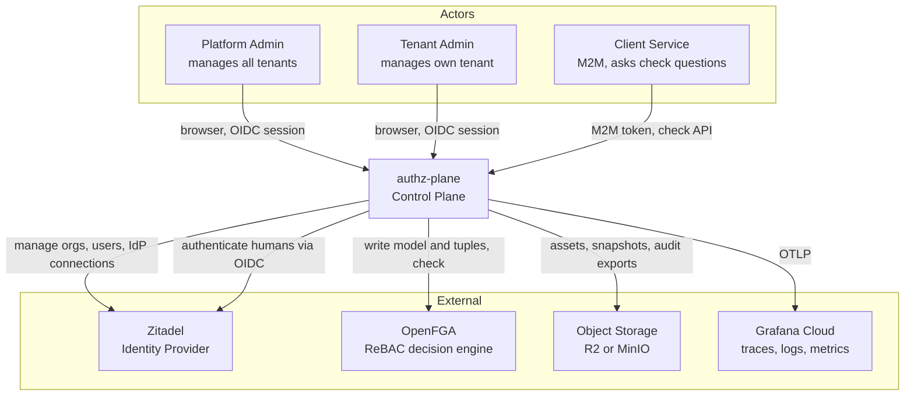

Note the dual relationship with Zitadel: authz-plane both **manages** Zitadel as a downstream resource and **depends on** it to authenticate its own operators. That is a real bootstrapping problem, addressed in §11.6.

---

## 5. Container architecture

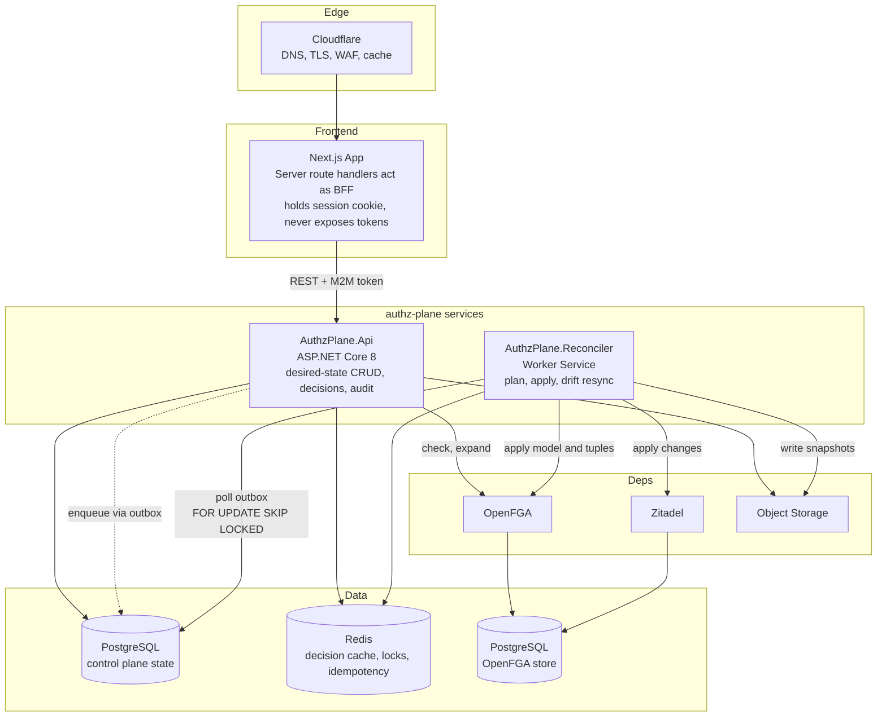

**Why API and Reconciler are separate processes:** they have different failure modes and different scaling axes. A slow reconcile against a rate-limited IdP must never consume request threads serving `/check`. In the MVP they can run as two deployments of the same image with different entrypoints.

---

## 6. Clean architecture layering

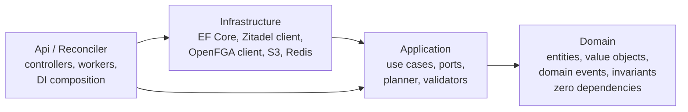

Dependency rule, enforced by tests (not by discipline): `Domain` references nothing. `Application` references only `Domain`. `Infrastructure` and the hosts reference `Application`. Nothing references `Infrastructure` except the hosts' DI wiring.

### 6.1 Ports defined in Application

| Port | Responsibility | Infrastructure implementation |
|---|---|---|
| `IIdentityProviderGateway` | CRUD orgs, IdP connections, users in the IdP | `ZitadelGateway` |
| `IAuthorizationStoreGateway` | Write model, write/delete tuples, check, expand, list-objects | `OpenFgaGateway` |
| `IObjectStore` | Put/get/presign objects | `S3CompatibleObjectStore` |
| `IReconcilePlanner` | `Plan(desired, actual) -> Change[]` | pure, lives in Application |
| `ITenantRepository`, `ISpecRepository`, `IReconcileRunRepository` | Persistence | EF Core |
| `IOutbox` | Enqueue intents transactionally | EF Core |
| `IDecisionCache` | Cache and invalidate check results | Redis |
| `IUnitOfWork`, `IClock`, `ICurrentUser` | Cross-cutting | various |
| `ISecretProtector` | Envelope-encrypt IdP client secrets | Data Protection + key from env |

The point of `IIdentityProviderGateway` is not theoretical purity. It is the thing that lets you say in an interview: "swap Zitadel for Keycloak or Auth0 by writing one adapter, and here is the contract test suite that any adapter must pass."

---

## 7. The reconciliation model

### 7.1 Core concepts

| Concept | Meaning |
|---|---|
| **Spec** | Immutable, versioned desired state. Each write creates a new version and bumps `generation`. |
| **Status** | Mutable observed state, including `observedGeneration`, `phase`, `lastError`. |
| **Converged** | `observedGeneration == generation` and `phase == Ready`. |
| **Change** | A single intended mutation of an external system, with a stable `changeKey` for idempotency. |
| **Plan** | Ordered list of Changes. Rendered in the UI before apply. |
| **Drift finding** | A field where actual state diverges from desired, discovered by periodic resync rather than by our own write. |

### 7.2 Reconcile sequence

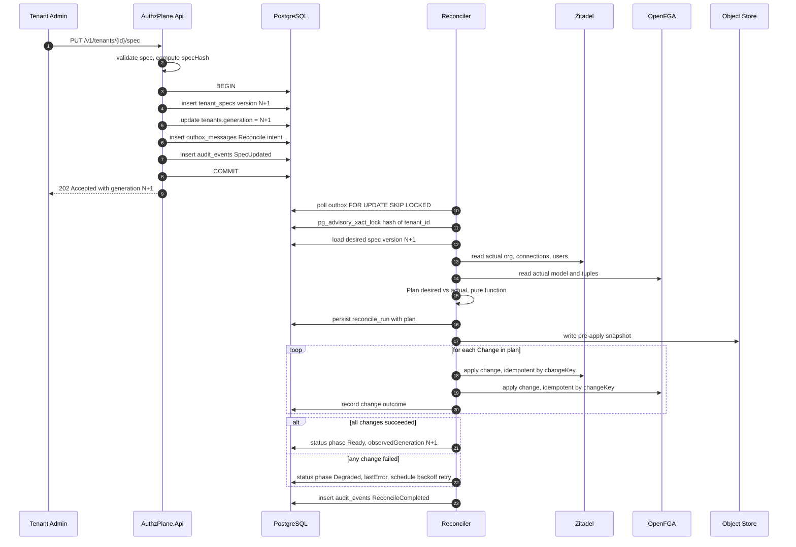

### 7.3 Tenant lifecycle state machine

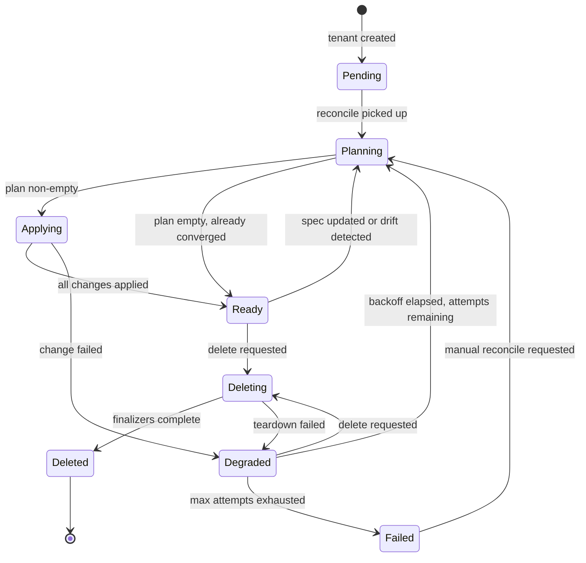

### 7.4 Correctness properties and how each is achieved

| Property | Mechanism |
|---|---|
| **At-most-one reconcile per tenant** | `pg_advisory_xact_lock(hashtext(tenant_id))` held for the duration of the run. A second worker skips rather than blocks. |
| **No lost triggers** | Outbox written in the same transaction as the spec. Worker deletes the message only after the run terminates. |
| **Idempotent apply** | Every Change has a deterministic `changeKey = hash(tenantId, resourceKind, resourceRef, targetStateHash)`. `external_resource_map` stores `changeKey -> external_id`. Re-applying a seen key is a no-op read. |
| **Convergence** | Exponential backoff with jitter: 5s, 15s, 45s, 2m, 6m, capped at 15m, max 8 attempts, then `Failed` (terminal, requires human). |
| **Stale-write protection** | Spec writes take `If-Match` on the current generation. Reconcile aborts if `generation` changed mid-run and re-enqueues. |
| **Ordered teardown** | Finalizers run in reverse dependency order: tuples → authorization model → IdP connections → users → org. Each step must be idempotent because teardown can partially fail and retry. |
| **Drift detection** | Periodic resync per tenant (default 10 min, jittered). Reads actual, computes `actualStateHash`, diffs field-by-field into `drift_findings`. Auto-heal is **opt-in per tenant** via `spec.reconcilePolicy.autoHeal`. |
| **Partial failure visibility** | Per-change status rows. A run can be `PartiallyApplied`; the UI shows exactly which change failed and why. |

### 7.5 Drift detection flow

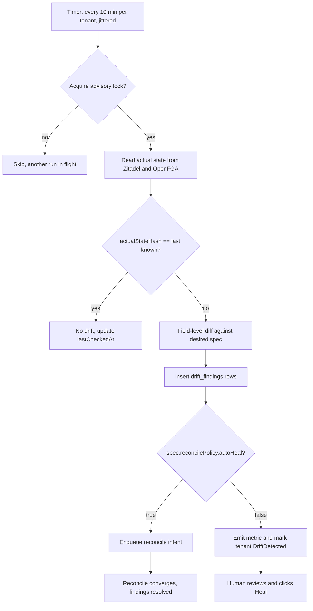

---

## 8. Data model

### 8.1 Entity relationships

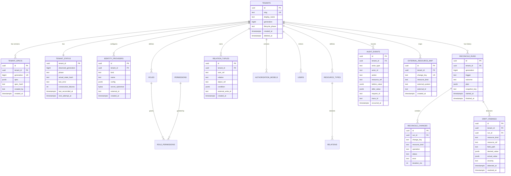

Additional tables not shown for diagram readability: `permissions`, `role_permissions`, `resource_types`, `relations`, `users`, `authorization_models`, `outbox_messages`, `idempotency_keys`, `api_clients`, `audit_exports`, `tenant_assets`.

### 8.2 Why desired and observed state are separate tables

This is the design detail worth defending in an interview. `tenant_specs` is append-only and immutable — it is a git-like history of intent. `tenant_status` is a single mutable row per tenant reflecting reality. Collapsing them into one table would mean the reconciler writing to the same rows humans write to, which produces write conflicts, an unusable audit trail, and no ability to answer "what did we intend at 14:32 yesterday."

### 8.3 Storage responsibilities

| Store | Holds | Why here |
|---|---|---|
| **PostgreSQL (control plane)** | Specs, status, runs, changes, drift, audit, outbox, external ID map | Needs transactions, joins, temporal queries, `jsonb` for flexible spec |
| **Redis** | Decision cache, advisory rate limits, idempotency keys with TTL | Sub-millisecond reads, natural TTL semantics |
| **OpenFGA + its Postgres** | Authorization model and tuples (source of truth for decisions) | We mirror tuples in our DB for planning, but FGA is authoritative for `check` |
| **Object storage (R2/MinIO)** | Pre-apply snapshots, audit-log exports, tenant branding assets | Large, immutable, cheap, presigned direct access |

### 8.4 Indexing plan

```sql
-- hot path: outbox polling
CREATE INDEX ix_outbox_pending ON outbox_messages (next_attempt_at)
  WHERE status = 'Pending';

-- hot path: tenant-scoped listing, always tenant-first
CREATE INDEX ix_tuples_tenant_object ON relation_tuples (tenant_id, object_ref, relation);
CREATE INDEX ix_tuples_tenant_user   ON relation_tuples (tenant_id, user_ref);

-- audit search
CREATE INDEX ix_audit_tenant_time ON audit_events (tenant_id, occurred_at DESC);
CREATE INDEX ix_audit_resource    ON audit_events (tenant_id, resource_ref, occurred_at DESC);

-- open drift only
CREATE INDEX ix_drift_open ON drift_findings (tenant_id, detected_at DESC)
  WHERE resolved_at IS NULL;

-- idempotency
CREATE UNIQUE INDEX ux_erm_change_key ON external_resource_map (change_key);
CREATE UNIQUE INDEX ux_spec_generation ON tenant_specs (tenant_id, generation);
```

Every tenant-scoped index leads with `tenant_id`. Partial indexes on `WHERE status = 'Pending'` and `WHERE resolved_at IS NULL` keep the hot indexes small — the pending set is tiny relative to history.

### 8.5 Tenant isolation

Defence in depth, three layers:

1. **Application layer** — a global EF Core query filter on every tenant-scoped entity, bound to `ICurrentTenant`. Cannot be forgotten per-query.
2. **Database layer** — PostgreSQL **Row Level Security** with a session variable (`SET LOCAL app.tenant_id`), so even a query that bypasses the filter returns nothing.
3. **Authorization layer** — the API's own permission check (§11.5) runs before the handler.

Layer 2 is optional for the 10-day MVP but it is a strong story and cheap to add. Mark it as day-9 stretch.

---

## 9. API surface

**~42 business endpoints across 9 groups, plus 4 platform endpoints.** All versioned under `/v1`. All errors are RFC 9457 `application/problem+json`. All mutations accept `Idempotency-Key`. All list endpoints are cursor-paginated.

| Group | Method + Path | MVP? | Notes |
|---|---|---|---|
| **Tenants** | `POST /v1/tenants` | ✅ | Creates tenant + initial spec, returns `generation` |
| | `GET /v1/tenants` | ✅ | Cursor paginated, filter by phase |
| | `GET /v1/tenants/{id}` | ✅ | Spec + status projection |
| | `PUT /v1/tenants/{id}/spec` | ✅ | New version. `If-Match: <generation>` required |
| | `GET /v1/tenants/{id}/spec/versions` | ✅ | History |
| | `GET /v1/tenants/{id}/spec/versions/{gen}` | ✅ | Point-in-time intent |
| | `POST /v1/tenants/{id}/spec:diff` | | Diff two generations |
| | `GET /v1/tenants/{id}/status` | ✅ | Phase, observedGeneration, lastError |
| | `DELETE /v1/tenants/{id}` | ✅ | Enters `Deleting`, runs finalizers |
| **Reconcile** | `POST /v1/tenants/{id}/reconcile` | ✅ | Manual trigger, `?dryRun=true` returns plan without applying |
| | `GET /v1/tenants/{id}/reconcile-runs` | ✅ | Run history |
| | `GET /v1/reconcile-runs/{runId}` | ✅ | Run detail |
| | `GET /v1/reconcile-runs/{runId}/changes` | ✅ | Per-change outcomes |
| | `GET /v1/reconcile-runs/{runId}/snapshot` | | Presigned URL to pre-apply snapshot |
| **Drift** | `GET /v1/tenants/{id}/drift` | ✅ | Open findings |
| | `POST /v1/tenants/{id}/drift:heal` | ✅ | Enqueue reconcile to close findings |
| | `POST /v1/tenants/{id}/drift/{findingId}:acknowledge` | | Suppress a known-acceptable divergence |
| **Identity providers** | `POST /v1/tenants/{id}/identity-providers` | ✅ | OIDC in MVP; SAML later |
| | `GET /v1/tenants/{id}/identity-providers` | ✅ | Secrets never returned |
| | `GET /v1/tenants/{id}/identity-providers/{idpId}` | ✅ | |
| | `PATCH /v1/tenants/{id}/identity-providers/{idpId}` | ✅ | Write-only secret field |
| | `DELETE /v1/tenants/{id}/identity-providers/{idpId}` | ✅ | |
| | `POST /v1/tenants/{id}/identity-providers/{idpId}:test` | | Validate discovery doc reachability |
| **Authorization model** | `PUT /v1/tenants/{id}/authorization-model` | ✅ | FGA DSL, validated then versioned |
| | `GET /v1/tenants/{id}/authorization-model` | ✅ | Current |
| | `GET /v1/tenants/{id}/authorization-model/versions` | | History |
| | `POST /v1/tenants/{id}/authorization-model:validate` | ✅ | Parse-only, no write |
| **Roles** | `POST /v1/tenants/{id}/roles` | ✅ | |
| | `GET /v1/tenants/{id}/roles` | ✅ | |
| | `PATCH /v1/tenants/{id}/roles/{roleId}` | ✅ | |
| | `DELETE /v1/tenants/{id}/roles/{roleId}` | ✅ | 409 if bound to tuples |
| **Relations** | `POST /v1/tenants/{id}/relations:write` | ✅ | Batch writes + deletes, atomic |
| | `GET /v1/tenants/{id}/relations` | ✅ | Filter by user, relation, object |
| | `DELETE /v1/tenants/{id}/relations/{tupleId}` | ✅ | |
| **Decisions** | `POST /v1/tenants/{id}/check` | ✅ | Single check, cached |
| | `POST /v1/tenants/{id}/batch-check` | ✅ | Up to 100 per call |
| | `POST /v1/tenants/{id}/explain` | ✅ | **The differentiator.** Returns the resolution tree |
| | `POST /v1/tenants/{id}/list-objects` | | "What can this user see" |
| **Users** | `POST /v1/tenants/{id}/users:invite` | | Delegates to IdP |
| | `GET /v1/tenants/{id}/users` | ✅ | Mirror, refreshed by reconcile |
| | `GET /v1/tenants/{id}/users/{userId}` | ✅ | |
| | `DELETE /v1/tenants/{id}/users/{userId}` | | |
| **Audit** | `GET /v1/tenants/{id}/audit-events` | ✅ | Filter by actor, action, time range |
| | `POST /v1/tenants/{id}/audit-exports` | | Async job → NDJSON.gz in object storage |
| | `GET /v1/audit-exports/{exportId}` | | Status + presigned download |
| **Assets** | `POST /v1/tenants/{id}/assets:presign` | | Presigned PUT for branding upload |
| | `GET /v1/tenants/{id}/assets` | | |
| **Platform** | `GET /healthz` · `GET /readyz` · `GET /metrics` · `GET /v1/version` | ✅ | `readyz` checks PG, Redis, FGA, Zitadel |

### 9.1 The `explain` response shape

This endpoint is why an interviewer will remember the project. It returns *why*, not just *whether*:

```json
{
  "allowed": true,
  "checkedAt": "2026-09-03T10:15:00Z",
  "durationMs": 7,
  "cached": false,
  "tree": {
    "node": "document:budget-2026#viewer",
    "result": "allowed",
    "via": "union",
    "children": [
      { "node": "document:budget-2026#viewer@user:raj", "result": "denied", "via": "direct" },
      {
        "node": "document:budget-2026#parent",
        "result": "allowed",
        "via": "tupleToUserset",
        "children": [
          { "node": "folder:finance#editor@user:raj", "result": "allowed", "via": "direct",
            "tupleId": "a3f1...", "writtenAt": "2026-08-30T09:00:00Z", "writtenBy": "admin@acme.test" }
        ]
      }
    ]
  }
}
```

Attributing the *decisive tuple* back to who wrote it and when is the bridge between authorization and audit. Most authz systems can't answer that.

### 9.2 Example tenant spec

```yaml
apiVersion: authzplane.dev/v1
kind: Tenant
metadata:
  slug: acme-air
  displayName: Acme Airways
spec:
  reconcilePolicy:
    autoHeal: false
    resyncIntervalSeconds: 600
  identityProviders:
    - name: acme-entra
      kind: oidc
      issuer: https://login.microsoftonline.com/<tenant>/v2.0
      clientId: <id>
      clientSecretRef: acme-entra-secret
      claimMappings: { email: email, name: name }
  authorizationModel: |
    model
      schema 1.1
    type user
    type folder
      relations
        define editor: [user]
        define viewer: [user] or editor
    type document
      relations
        define parent: [folder]
        define editor: [user] or editor from parent
        define viewer: [user] or editor or viewer from parent
  roles:
    - key: tenant_admin
      permissions: [tenant.read, tenant.write, relations.write, audit.read]
    - key: tenant_viewer
      permissions: [tenant.read, audit.read]
  relations:
    - user: user:raj
      relation: editor
      object: folder:finance
```

---

## 10. UI: framework decision

**Next.js (App Router), not plain React + Vite.**

To be precise about *why*, because the obvious reason is the wrong one: **this is not about SSR or SEO.** An internal admin console has no SEO requirement and rendering server-side gains nothing for a dashboard behind a login.

The reason is the **BFF authentication boundary**. Next.js route handlers give you a first-class server-side execution context colocated with the UI. That lets you replicate exactly the pattern you own in production:

```mermaid
sequenceDiagram
    autonumber
    participant B as Browser
    participant N as "Next.js route handlers (BFF)"
    participant Z as Zitadel
    participant A as AuthzPlane.Api

    B->>N: GET /login
    N->>N: generate state, nonce, PKCE verifier; store in HttpOnly cookie
    N-->>B: 302 to Zitadel authorize URL with code_challenge
    B->>Z: authenticate
    Z-->>B: 302 /api/auth/callback?code=...&state=...
    B->>N: GET /api/auth/callback
    N->>N: validate state, retrieve verifier
    N->>Z: POST /oauth/v2/token, code + code_verifier
    Z-->>N: access_token, refresh_token, id_token
    N->>N: validate id_token: signature via JWKS, iss, aud, nonce, exp
    N->>N: encrypt tokens into HttpOnly SameSite=Lax session cookie
    N-->>B: 302 /dashboard, Set-Cookie
    B->>N: GET /api/tenants, cookie only
    N->>N: decrypt session, refresh if near expiry
    N->>A: GET /v1/tenants, Authorization Bearer
    A-->>N: 200
    N-->>B: 200 JSON
```

**No access token, no refresh token, and no `id_token` ever reaches browser JavaScript.** That kills token theft via XSS as an attack class. It is the same architecture as your `bff-svc`, which means the project reinforces your strongest resume claim instead of sitting beside it.

Rendering plan: server components for the shell and initial data fetch, client components for anything interactive (the relation graph, the explain tree, the drift table). Do not fight the framework by making everything a client component with `useEffect` fetches — that throws away the reason you picked it.

**Stack:** Next.js 14+ App Router · TypeScript strict · TanStack Query for client-side cache · Tailwind · shadcn/ui · React Flow for the relation graph · Zod for schema validation shared with the OpenAPI-generated client.

Generate the TypeScript client from the API's OpenAPI document in CI. A hand-written client drifts from the API within a week.

---

## 11. Security design

### 11.1 Threat model

| # | Threat | Vector | Mitigation |
|---|---|---|---|
| T1 | **Cross-tenant data access** | Attacker passes another tenant's `tenantId` in path or body | Tenant derived from token claims, then asserted against path. Body `tenantId` ignored entirely. EF global filter + Postgres RLS. |
| T2 | **Privilege escalation via tuple write** | Tenant admin writes a tuple granting themselves platform-admin | Reserved object namespace `platform:*` rejected at validation. Tuple writes checked against the tenant's own authorization model only. |
| T3 | **SSRF via IdP discovery URL** | `issuer: http://169.254.169.254/latest/meta-data/` to reach cloud metadata | Allowlist scheme `https` only; resolve DNS and **reject private, loopback, link-local, and CGNAT ranges**; no redirects followed; 3s timeout; egress via a dedicated HttpClient with a validating handler. |
| T4 | **XSS → token theft** | Injected script reads tokens | BFF pattern; no tokens in JS-reachable storage. Strict CSP with nonces, no `unsafe-inline`. |
| T5 | **CSRF on mutations** | Cross-site form post with session cookie | `SameSite=Lax` + double-submit CSRF token on all non-GET route handlers + `Origin` check. |
| T6 | **Secret disclosure** | IdP client secret leaked via API or logs | Envelope encryption at rest; field is write-only in the API contract; log redaction middleware on a keyword denylist; secrets never in spec history responses. |
| T7 | **Replayed / duplicated mutation** | Retry storm creates duplicate orgs | `Idempotency-Key` + `external_resource_map` on `changeKey`. |
| T8 | **Decision cache poisoning / staleness** | Tuple revoked but cache still allows | Cache key includes tenant model version; **tuple writes invalidate by tag before returning**; TTL capped at 30s; `check` supports `?consistency=strong` to bypass cache. |
| T9 | **Audit log tampering or injection** | Attacker writes newlines/JSON into an actor field to forge entries | Audit writes are append-only (no UPDATE/DELETE grant for the app role); all values stored as `jsonb` parameters, never string-concatenated. |
| T10 | **Denial of service via expensive checks** | Deeply nested `list-objects` on a huge graph | Per-tenant rate limits (token bucket in Redis), max graph depth, query timeout, request size cap, `batch-check` capped at 100. |
| T11 | **Reconciler as confused deputy** | Malicious spec makes the reconciler call an attacker-controlled endpoint with its credentials | Reconciler only ever calls the configured Zitadel/FGA base URLs from environment config, never a URL from tenant spec data. |
| T12 | **PII in traces and logs** | Emails in span attributes shipped to a third party | Allowlist of span attributes; emails hashed in telemetry; raw PII only in Postgres. |

### 11.2 Authentication

- **Humans:** OIDC Authorization Code + PKCE against Zitadel, session held server-side in an encrypted cookie (§10).
- **Machines:** `client_credentials` with audience-scoped tokens. JWKS fetched and cached with a 10-minute TTL and a hard refresh on unknown `kid`. Validate `iss`, `aud`, `exp`, `nbf`, and reject `alg: none` and any asymmetric/symmetric confusion by pinning expected algorithms explicitly.

### 11.3 Authorization: dogfooding

authz-plane authorizes **itself** using OpenFGA. Its own model:

```
type user
type tenant
  relations
    define admin: [user]
    define viewer: [user] or admin
type platform
  relations
    define superadmin: [user]
    define tenant_creator: [user] or superadmin
```

Every endpoint declares its required check, enforced by an authorization filter:

```
PUT /v1/tenants/{id}/spec  ->  check(user, "admin",  "tenant:{id}")
GET /v1/tenants/{id}       ->  check(user, "viewer", "tenant:{id}")
POST /v1/tenants           ->  check(user, "tenant_creator", "platform:root")
```

This is worth doing for its own sake: it means the authorization engine is exercised by every single request, so bugs surface immediately rather than in a test-only path.

### 11.4 Secrets handling

| Secret | Where it lives | Never |
|---|---|---|
| IdP client secrets | `bytea` ciphertext in Postgres, envelope-encrypted with a KEK from env | Returned by any API, logged, or included in snapshots |
| Session encryption key | Environment variable, rotated by restart | In the repo |
| M2M client secrets | GitHub Environments secret → k8s Secret | In values.yaml |
| DB / Redis / R2 credentials | k8s Secrets, mounted as env | Committed |

`gitleaks` runs on every PR precisely because "I'll be careful" is not a control.

### 11.5 Bootstrapping problem

authz-plane needs Zitadel to authenticate operators, but authz-plane manages Zitadel. Circular dependency on first boot.

**Resolution:** Zitadel is provisioned out-of-band as **platform infrastructure** (OpenTofu, day 9), including a `platform` organization, an authz-plane API application, and a bootstrap admin. authz-plane manages only *tenant* organizations, never the platform org. A documented invariant, enforced by rejecting any change whose target is the platform org.

---

## 12. Observability and SLOs

### 12.1 Traces

One span per reconcile run, child span per Change, with W3C trace context propagated into Zitadel and OpenFGA calls. Span attributes: `tenant.id`, `reconcile.generation`, `reconcile.trigger`, `change.kind`, `change.key`, `change.outcome`.

The reconcile trace is the artifact that makes debugging possible — a single waterfall showing exactly which downstream call was slow or failed, per tenant, per generation.

### 12.2 Metrics

| Metric | Type | Purpose |
|---|---|---|
| `authzplane_reconcile_duration_seconds` | histogram (by outcome) | Convergence latency |
| `authzplane_reconcile_total` | counter (by outcome) | Failure rate |
| `authzplane_reconcile_attempts` | histogram | Is backoff working |
| `authzplane_convergence_lag_seconds` | gauge | `now - specCreatedAt` for unconverged tenants. **The key SLI.** |
| `authzplane_drift_findings_open` | gauge (by kind) | Drift pressure |
| `authzplane_outbox_lag_seconds` | gauge | Worker keeping up |
| `authzplane_outbox_depth` | gauge | Queue depth |
| `authzplane_check_duration_seconds` | histogram (by cached) | Decision latency |
| `authzplane_check_cache_hit_ratio` | gauge | Cache effectiveness |
| `authzplane_idp_call_duration_seconds` | histogram (by op, status) | Downstream health |

### 12.3 SLOs

| SLI | Target | Measured by |
|---|---|---|
| `check` latency, cache hit | p99 < 15 ms | histogram |
| `check` latency, cache miss | p99 < 80 ms | histogram |
| Convergence after spec write | p95 < 30 s | `convergence_lag_seconds` |
| Reconcile success rate | > 99% excluding downstream outages | counter ratio |
| API availability | > 99% | probe |

Publish measured numbers from k6 in the README. An unmeasured SLO is decoration.

### 12.4 Fault injection (your debugging evidence)

A config-gated middleware injects faults so you can generate real incidents and write real postmortems:

| Fault | What it should prove |
|---|---|
| Zitadel returns 429 with `Retry-After` | Backoff respects the header, no thundering herd |
| Zitadel times out mid-apply | Partial apply recorded; retry is idempotent, no duplicate org |
| OpenFGA partitioned during tuple write | Run goes `Degraded`, converges after recovery |
| Reconciler SIGKILL mid-run | Advisory lock released, outbox message redelivered, no double-apply |
| Postgres connection pool exhausted | API sheds load with 503, reconciler doesn't starve the API |
| Clock skew on token validation | `exp`/`nbf` handling with leeway |
| Tuple revoked while cached | Invalidation closes the window; measure the actual window |

Each one gets a file in `docs/incidents/` with timeline, root cause, why it wasn't caught, and the fix. **These files are the single most differentiating thing in the repo** — because they're the only thing there that proves you can debug rather than just build.

---

## 13. Testing strategy

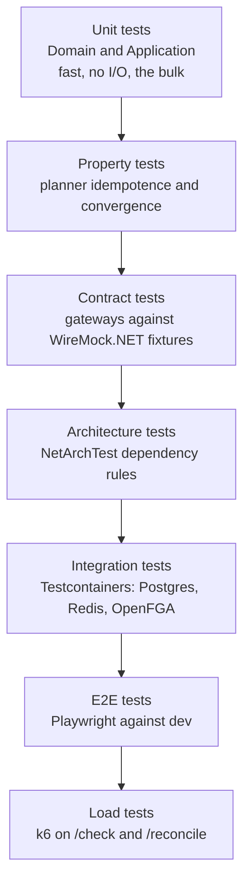

### 13.1 The property tests that matter

Because `Plan` is pure, you can assert the control-plane invariants directly:

| Property | Assertion |
|---|---|
| **Idempotence** | `Plan(d, Apply(Plan(d, a), a)) == []` — applying a plan reaches a state needing no further changes |
| **Convergence** | For any `(desired, actual)`, applying the plan yields `actual' == desired` on all managed fields |
| **No-op stability** | `Plan(d, d) == []` — identical desired and actual produce zero changes |
| **Order independence** | Changes touching disjoint resources may be reordered without changing the result |
| **Unmanaged-field preservation** | Fields not in the spec are never modified |

FsCheck generates the tenant specs. These five properties catch the entire class of bug that makes control planes flap between two states, which is the failure mode you would otherwise discover in production at 2am.

### 13.2 Architecture tests

```csharp
[Fact]
public void Domain_has_no_outward_dependencies() =>
    Types.InAssembly(DomainAssembly)
        .ShouldNot().HaveDependencyOnAny("AuthzPlane.Application",
            "AuthzPlane.Infrastructure", "Microsoft.EntityFrameworkCore")
        .GetResult().IsSuccessful.Should().BeTrue();
```

Also assert: no `DateTime.Now` outside `IClock` implementations; all public API DTOs live in `Contracts`; every controller action has an authorization attribute. That last one is a security control implemented as a test — nobody can ship an unauthenticated endpoint by accident.

### 13.3 Coverage policy

Gate at **70% line coverage on `Domain` + `Application` only.** Do not gate on Infrastructure or the hosts — you'd be writing tests for DI wiring to satisfy a number. State this rationale in the README; a thoughtful coverage policy reads better than a high number.

---

## 14. CI/CD

Single protected `dev` branch, GitHub Actions, GHCR, **pull-based delivery via Flux**.

### 14.1 Pipeline

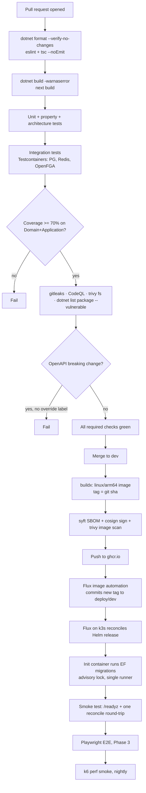

### 14.2 Workflows

| File | Trigger | Does |
|---|---|---|
| `pr.yml` | `pull_request` → dev | Format, build, all tests, coverage gate, security scans, OpenAPI diff |
| `dev.yml` | `push` → dev | Build arm64 image, SBOM, sign, scan, push GHCR |
| `nightly.yml` | cron | Trivy rescan of published images, k6 perf, drift check against dev |
| `e2e.yml` | `workflow_dispatch` + post-deploy | Playwright (Phase 3) |
| `codeql.yml` | PR + weekly | Static analysis |

### 14.3 Why pull-based delivery

Push-based deploy means storing a kubeconfig or long-lived cloud credential in GitHub, and a compromised Actions run then owns your cluster. **Flux runs inside the cluster and pulls.** CI's only privilege is pushing an image and committing a tag bump. Nothing in GitHub can touch the cluster directly.

Say exactly that in the ADR. Reviewers notice supply-chain reasoning.

### 14.4 Branch protection on `dev`

- Require pull request before merge
- Require status checks: `pr.yml` jobs all green
- Require linear history, require conversation resolution
- Block force push and deletion
- Require signed commits
- **Honest caveat:** on a solo personal repo you cannot require an *approval* from someone else, and self-approval is disallowed. Required status checks are the real gate. Don't claim "PR review required" in the README if there's nobody to review — claim what's true.

### 14.5 ARM64 build note

Oracle Ampere is `linux/arm64`. Options, in order of preference:

1. **GitHub-hosted arm64 runners** — check current availability for public repos; if available, use them. Native, fast.
2. **Self-hosted runner on the Oracle box** — native and free, but the box is small and a runner competes with your workload.
3. **buildx + QEMU emulation** — always works, roughly 3–6× slower. Acceptable for a small .NET image.

Start with option 3 so day 9 isn't blocked on infrastructure archaeology, then optimise.

### 14.6 Migrations in CI/CD

EF Core migrations run in a Kubernetes **init container**, guarded by a Postgres advisory lock so concurrent pods can't race. Rules:
- Migrations must be **backward compatible for one release** (expand, then contract in a later release). Never drop a column in the same release that stops writing it.
- Migration script generated and reviewed in the PR (`dotnet ef migrations script --idempotent`), committed as an artifact. Nobody merges a migration they haven't read as SQL.

---

## 15. Deployment topology

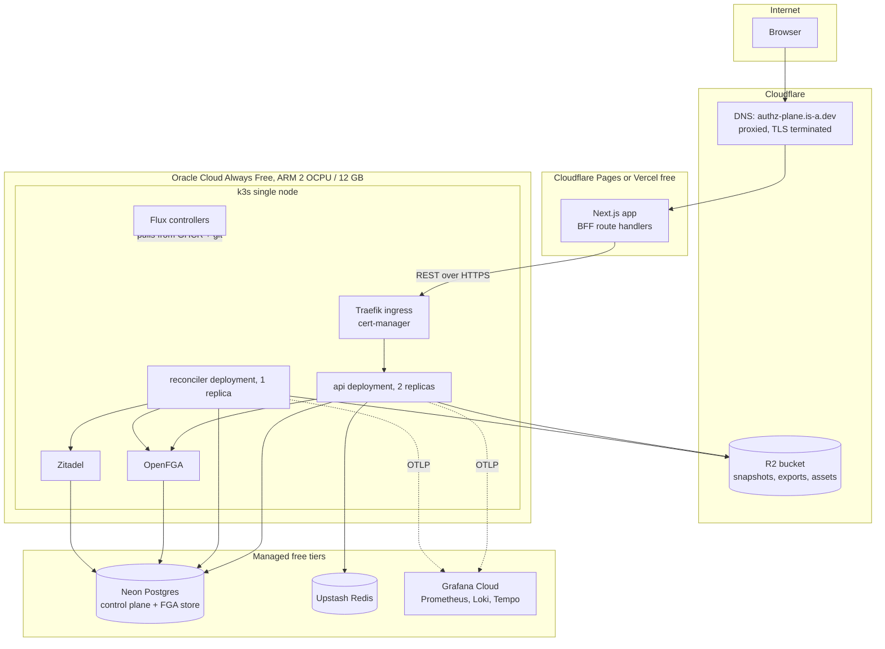

**Resource budget on 12 GB / 2 OCPU** — this is the real constraint and it drove several decisions:

| Component | Memory request | Notes |
|---|---|---|
| k3s + system | ~1.0 GB | |
| Traefik + cert-manager | ~0.3 GB | |
| Flux controllers | ~0.4 GB | |
| Zitadel | ~1.5 GB | The heavy one. This is why not Keycloak. |
| OpenFGA | ~0.4 GB | Go, light |
| authz-plane api × 2 | ~0.8 GB | |
| authz-plane reconciler | ~0.4 GB | |
| **Headroom** | **~7 GB** | For build spikes, k6, and the fault-injection experiments |

Postgres and Redis are deliberately **off-cluster** on managed free tiers. Self-hosting them would eat the headroom and add operational work that teaches you nothing new.

⚠️ **Verify before day 9:** Oracle halved the Always Free ARM allowance to 2 OCPU / 12 GB effective June 2026, with over-limit instances terminated from August 2026. Confirm your tenancy's current limit and whether a PAYG upgrade restores 4 OCPU / 24 GB — reports conflicted. Also expect "out of host capacity" errors; retry, or pick an EU/APAC home region.

---

## 16. Repository layout

```
authz-plane/
├── README.md                     # what, why, screenshots, measured SLO numbers, NOT-PRODUCTION notice
├── docs/
│   ├── system-design.md          # this document
│   ├── adr/                      # ADR-001 … ADR-010
│   ├── incidents/                # postmortems from fault injection  <-- the differentiator
│   ├── api/openapi.yaml          # generated, committed, diffed in CI
│   └── diagrams/                 # mermaid sources
├── src/
│   ├── AuthzPlane.Domain/
│   ├── AuthzPlane.Application/
│   ├── AuthzPlane.Infrastructure/
│   ├── AuthzPlane.Contracts/
│   ├── AuthzPlane.Api/
│   └── AuthzPlane.Reconciler/
├── tests/
│   ├── AuthzPlane.Domain.UnitTests/
│   ├── AuthzPlane.Application.UnitTests/
│   ├── AuthzPlane.Application.PropertyTests/
│   ├── AuthzPlane.Architecture.Tests/
│   ├── AuthzPlane.Integration.Tests/       # Testcontainers
│   └── AuthzPlane.Contract.Tests/          # WireMock.NET
├── web/                          # Next.js app
├── deploy/
│   ├── helm/authz-plane/
│   ├── flux/                     # GitRepository, HelmRelease, ImagePolicy
│   └── tofu/                     # OpenTofu: OCI instance, Cloudflare DNS, R2, Zitadel bootstrap
├── perf/k6/
├── .github/workflows/
├── docker-compose.yml            # full local stack, one command
└── Makefile                      # make up, make test, make plan
```

`docker-compose up` bringing up the entire stack including Zitadel and OpenFGA with seed data is a hard requirement. If a reviewer can't run it in one command, they won't run it at all.

---

## 17. ADR index

Write these as you go, not at the end. Each is 200–400 words: context, options considered, decision, consequences.

| ADR | Title |
|---|---|
| 001 | Control plane with own API instead of Kubernetes CRDs |
| 002 | Plan/Apply separation with a pure planner |
| 003 | Transactional outbox for reconcile triggers instead of a message broker |
| 004 | Postgres advisory locks for per-tenant reconcile mutual exclusion |
| 005 | Zitadel over Keycloak (memory footprint on a 12 GB node) |
| 006 | OpenFGA for ReBAC; why not Casbin, OPA, or a hand-rolled RBAC table |
| 007 | Next.js BFF for the auth boundary; SSR is not the reason |
| 008 | Pull-based delivery with Flux instead of push from CI |
| 009 | Kubernetes CRD adapter deferred to Phase 2 |
| 010 | Coverage gated on Domain+Application only |

---

## 18. 10-day plan of action

Assumes 5–6 focused hours per day. **This is tight.** I'd rather you hit day 10 with a working spine and honest ADRs than a half-wired everything. The cut line is defined in §18.3 — read it before you start, not on day 8.

### Day 0 — Prep (do this before the clock starts)

- Oracle Cloud account, ARM instance provisioned, k3s installed, SSH working
- Neon Postgres, Upstash Redis, Cloudflare R2 bucket, Grafana Cloud stack
- `is-a.dev` subdomain PR opened (it goes through review, so open it now — and note that the merged PR is a genuine open-source contribution)
- Repo created, `dev` branch protected, solution skeleton with all projects and project references wired
- `docker-compose.yml` bringing up Postgres, Redis, OpenFGA, Zitadel locally

**Done means:** `docker compose up` works, `dotnet build` succeeds, you can SSH to the box.

### Day 1 — Domain and persistence foundation

- Domain entities: `Tenant`, `TenantSpec`, `TenantStatus`, `ReconcileRun`, `Change`, `DriftFinding`, `RelationTuple`, value objects for `TenantSlug`, `Generation`, `SpecHash`
- EF Core `DbContext`, first migration, global tenant query filter
- Architecture tests enforcing the dependency rule
- `pr.yml` running format + build + unit + architecture tests, **green**

**Done means:** CI is green on a PR before any feature exists. Never build features on a red pipeline.

### Day 2 — Tenant CRUD, spec versioning, audit, outbox

- `POST /v1/tenants`, `GET /v1/tenants`, `GET /v1/tenants/{id}`, `PUT /v1/tenants/{id}/spec` with `If-Match`
- Immutable spec versioning + `generation` bump
- Transactional outbox write in the same transaction
- Audit interceptor capturing before/after on every mutation
- `Idempotency-Key` middleware
- ProblemDetails error handling

**Done means:** integration test proves spec write + outbox row + audit row commit atomically, and roll back together on failure.

### Day 3 — Gateways behind ports

- `IIdentityProviderGateway` → `ZitadelGateway`: create org, create OIDC connection, list users
- `IAuthorizationStoreGateway` → `OpenFgaGateway`: write model, write/delete tuples, check, expand
- Retry with exponential backoff + jitter, `Retry-After` honoured, circuit breaker (Polly)
- Contract tests against WireMock.NET fixtures, including 429 and 5xx paths
- `IObjectStore` → S3-compatible implementation

**Done means:** every gateway method has a contract test for success, 4xx, 429, 5xx, and timeout.

### Day 4 — The planner ⚠️ protect this day

- `Plan(desired, actual) -> Change[]`, pure, no I/O
- Deterministic `changeKey` computation
- Dependency ordering (org before connection before tuples)
- Property tests for all five invariants in §13.1
- `POST /v1/tenants/{id}/reconcile?dryRun=true` returning the plan

**Done means:** all five properties pass on 1000 generated cases. If they don't, stop and fix — everything downstream depends on this being correct.

### Day 5 — Applier and the state machine

- Reconciler worker: outbox poll with `FOR UPDATE SKIP LOCKED`
- Per-tenant advisory lock
- Apply loop with per-change outcome recording
- Phase machine: Pending → Planning → Applying → Ready / Degraded / Failed
- Backoff scheduling, `consecutive_failures`, terminal Failed
- Finalizers for delete, reverse-ordered
- `GET .../reconcile-runs`, `GET /reconcile-runs/{id}/changes`

**Done means:** integration test where a tenant spec is written and the tenant reaches `Ready` with `observedGeneration == generation`, plus a test where a gateway fails and the tenant reaches `Degraded` then recovers.

### Day 6 — Drift detection

- Periodic resync per tenant, jittered
- Actual-state hashing and field-level diff
- `drift_findings` persistence, `GET .../drift`, `POST .../drift:heal`
- Pre-apply snapshots written to object storage
- `autoHeal` policy honoured

**Done means:** you mutate Zitadel directly out-of-band (curl, not through the API) and the next resync reports the exact drifted field. This is the money demo — record it as a GIF.

### Day 7 — Decisions and caching

- `POST .../check`, `batch-check`, `explain` with the resolution tree
- Redis decision cache, keyed with model version, tag-invalidated on tuple write
- `?consistency=strong` bypass
- Per-tenant rate limiting
- k6 baseline for `/check`, cached and uncached — record real numbers

**Done means:** a test that writes a tuple, checks (allowed), deletes the tuple, and checks again (denied) with no stale window. Plus measured p99 numbers in the README.

### Day 8 — UI

- Next.js BFF auth: login, callback, session cookie, refresh, logout
- Screens: tenant list with phase badges, tenant detail (spec + status + generation), reconcile run timeline with per-change outcomes, drift table with heal action, permission playground with explain-tree rendering
- OpenAPI-generated TypeScript client
- Vitest for critical client logic, `tsc --noEmit` in CI

**Done means:** you can drive the entire loop from the browser without touching curl, and DevTools shows no token in storage or JS-readable cookies.

### Day 9 — Deploy and CI/CD

- Helm chart, Flux `GitRepository` + `HelmRelease` + image automation
- OpenTofu for OCI instance, Cloudflare DNS, R2, Zitadel platform bootstrap
- `dev.yml`: arm64 build, SBOM, cosign, GHCR push, tag bump
- cert-manager TLS on `authz-plane.is-a.dev`
- OTel exporters wired to Grafana Cloud; dashboard with the §12.2 metrics
- EF migration init container with advisory lock
- Smoke test post-deploy
- Postgres RLS if time allows

**Done means:** you push to `dev` and the change is live without you touching the cluster.

### Day 10 — Fault injection, docs, polish

- Fault injection middleware, config-gated
- Run at least **three** experiments from §12.4 and write real postmortems in `docs/incidents/`
- All 10 ADRs written
- README: architecture diagram, screenshots, measured SLO numbers, one-command local setup, explicit NOT-PRODUCTION notice
- Demo GIF of the drift-detection loop
- Tag `v0.1.0`

**Done means:** a stranger can clone, run `docker compose up`, and understand the design in five minutes of README.

### 18.1 Timeline

```mermaid
flowchart LR
    D0["Day 0<br/>Prep"] --> D1["Day 1<br/>Domain + CI green"]
    D1 --> D2["Day 2<br/>CRUD + outbox + audit"]
    D2 --> D3["Day 3<br/>Gateways + contracts"]
    D3 --> D4["Day 4<br/>PLANNER<br/>protect this"]
    D4 --> D5["Day 5<br/>Applier + state machine"]
    D5 --> D6["Day 6<br/>Drift detection"]
    D6 --> D7["Day 7<br/>Decisions + cache"]
    D7 --> D8["Day 8<br/>Next.js BFF + screens"]
    D8 --> D9["Day 9<br/>Deploy + CI/CD"]
    D9 --> D10["Day 10<br/>Faults + docs"]
```

### 18.2 Phase 2 backlog (after the 10 days)

Kubernetes CRD adapter · SAML IdP support · Playwright E2E in CI · `list-objects` with pagination · audit exports · tenant branding assets · spec diff view · Postgres RLS if skipped · multi-region read replicas (design only) · the `rca-engine` correlation idea as a separate repo.

### 18.3 Cut line — decide now, not on day 8

If you are behind, drop in **this order**:

1. `list-objects`, audit exports, tenant assets, users/invite (whole endpoint groups)
2. Drift auto-heal (keep detection, make healing manual only)
3. Spec diff endpoint and version-history UI
4. Postgres RLS (keep the EF filter)
5. UI polish — an ugly but functional console beats a pretty half-console

**Never cut:** the planner property tests, the reconcile state machine, drift detection, the `explain` endpoint, the postmortems, or the ADRs. Those six things *are* the project. Everything else is surface area.

---

## 19. Risk register

| Risk | Likelihood | Impact | Mitigation |
|---|---|---|---|
| Oracle ARM capacity unavailable in your region | High | Blocks day 9 | Provision on **day 0**, not day 9. Try EU/APAC home regions. Fallback: Fly.io or Koyeb free tier for the API, skip self-hosted k3s and lose the K8s story. |
| Oracle free tier shrinks again or instance terminated | Medium | Loses the deployment | Everything in OpenTofu + Flux, so rebuild is ~30 min. Keep Neon/R2 off-box so no data lives on it. |
| Zitadel too heavy for 12 GB alongside everything | Medium | Forces redesign | Zitadel Cloud free tier as fallback; drop self-hosted IdP, keep the gateway abstraction |
| Planner turns out harder than a day | Medium | Cascades into days 5–7 | It's the one day with a hard protect flag. If day 4 slips, cut from §18.3 immediately, don't compress day 5. |
| 10 days is genuinely not enough | **High** | Unfinished repo | Ship `v0.1.0` on day 10 whatever state it's in, with a README that's honest about scope. A tagged, honest, working spine beats an untagged sprawl. |
| Scope creep into building an IdP or policy engine | Medium | Project death | Non-goals in §2 are load-bearing. Re-read them when tempted. |
| Secrets committed | Low | Severe | gitleaks in `pr.yml` from day 1 |
| First time doing K8s/Flux/OpenTofu together | High | Day 9 overruns | Do a throwaway "hello world" Flux deploy on day 0 so day 9 is the second time, not the first |

---

## 20. Definition of done

The project is resume-ready when all of these are true:

- [ ] `docker compose up` brings up the full stack locally with seed data
- [ ] Live at `authz-plane.is-a.dev` with valid TLS
- [ ] Push to `dev` deploys automatically with no manual cluster access
- [ ] All five planner properties pass under property-based testing
- [ ] A tenant converges from spec write to `Ready` end to end
- [ ] Out-of-band console edit is detected as drift and healable
- [ ] `explain` returns a resolution tree naming the decisive tuple and who wrote it
- [ ] Measured p99 for `check` published in the README
- [ ] ≥3 postmortems in `docs/incidents/` from real injected faults
- [ ] 10 ADRs written
- [ ] README states plainly that this is not production software
- [ ] Tagged `v0.1.0`

### What to claim on your resume when it's done

> **authz-plane** — Multi-tenant identity and authorization control plane. Declarative tenant specs reconciled continuously into Zitadel and OpenFGA using a Kubernetes-operator-style control loop: pure plan/apply separation, transactional outbox, per-tenant advisory locking, drift detection with read-repair, and ReBAC decisions with a full explain trace. .NET 8 Clean Architecture, Next.js BFF auth, PostgreSQL, Redis, S3-compatible storage, k3s + Flux GitOps, OpenTelemetry. `authz-plane.is-a.dev`

### What not to claim

Not "production-grade." Not "highly available." Not "handles millions of requests" unless you have the k6 output to prove it. Not "enterprise-ready." One overclaim in an interview costs you more than three missing features — and the person reading this repo will be the type who checks.
